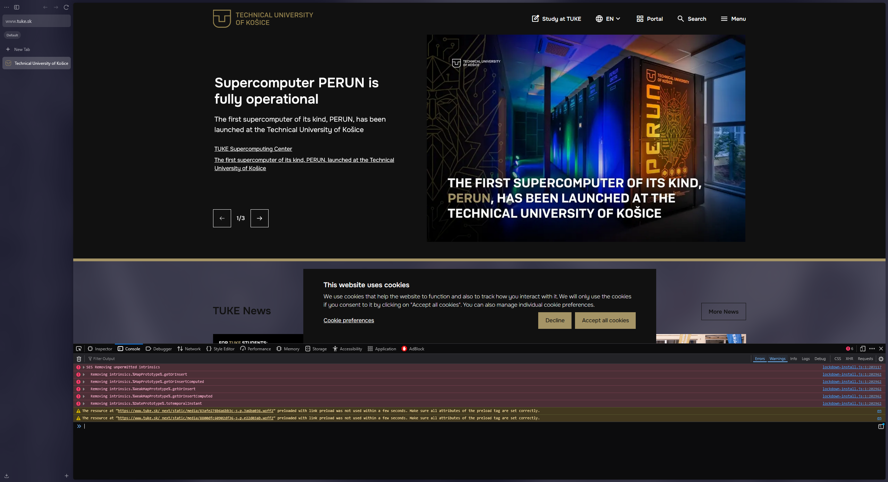

# [BUG-001] Multiple SES Script Errors and Resource Preload Warnings on Home Page

**Severity:** Medium
**Priority:** Medium 

---
## Summary
When loading the main page `tuke.sk`, the browser console displays several fatal script errors related to the SES blocking policy, as well as warnings about unused preloaded resources.

## Environment
- **URL:** https://www.tuke.sk/sk
- **Browser:** Zen Browser 1.18.10b (64-bit) / Based on Firefox 147.0.4
- **OS:** Windows 11
- **Testing Type:** Grey Box Testing (Manual + DevTools analysis)

## Steps to Reproduce
1. Open **Zen Browser**.
2. Navigate to `https://www.tuke.sk/sk`.
3. Open Developer Tools (`F12`) and switch to the **Console** tab.
4. Ensure filters for **Errors** and **Warnings** are enabled.

## Actual Result
The console logs the following issues:
1. **6 Errors:** `SES Removing unpermitted intrinsics` targeting `MapPrototype`, `WeakMapPrototype`, and `DatePrototype`. These errors originate from `lockdown-install.js`.
2. **2 Warnings:** Preloaded fonts (`.woff2`) were not used by the page within the first few seconds of loading.

## Expected Result
- The production environment console should be free of red execution errors.
- All preloaded resources should be used by the application to ensure optimal performance.

---
## Evidence

### 1. Global Console Errors (SES)
Massive Security (SES) and script initialization errors appearing immediately upon page load.
