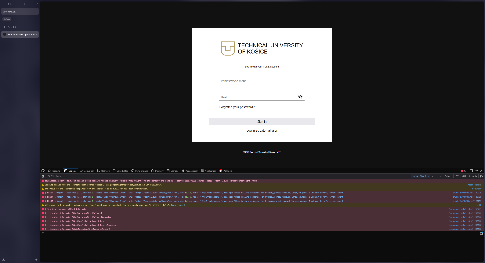

# [BUG-002] Critical API Failures and Mixed Content upon Chatbot Interaction

**Severity:** Major
**Priority:** High 

---
## Summary
Clicking the chatbot button triggers multiple critical console errors, including failed API requests for localization files (`en.json`) and Mixed Content warnings.

## Environment
- **URL:** https://www.tuke.sk/sk
- **Browser:** Zen Browser 1.18.10b (64-bit) / Based on Firefox 147.0.4
- **OS:** Windows 11
- **Testing Type:** Grey Box Testing (Manual + DevTools analysis)

## Steps to Reproduce
1. Open **Zen Browser**.
2. Navigate to `https://www.tuke.sk/sk`.
3. Locate and click on the **Chatbot icon/button** (bottom right).
4. Open Developer Tools (`F12`) and switch to the **Console** tab.
5. Ensure filters for **Errors** and **Warnings** are enabled.

## Actual Result
- **API Errors:** Multiple `Http failure response` errors for `https://portal.tuke.sk/langs/en.json` (Status: 0 Unknown Error)
- **Mixed Content:** Warning from `robot_icon.svg` being requested via insecure HTTP.
- **Resource Failures:** Failure to load fonts and Google Tab Manager scripts.

## Expected Result
- The Chatbot should initialize without console errors.
- All assets (fonts, icons, JSON files) should load via secure HTTPS with Status 200.

---
## Evidence

### 1. Chatbot Resource Failure
Network failures and "Unknown Error" (Status 0) when attempting to load the chatbot interface and its assets.
