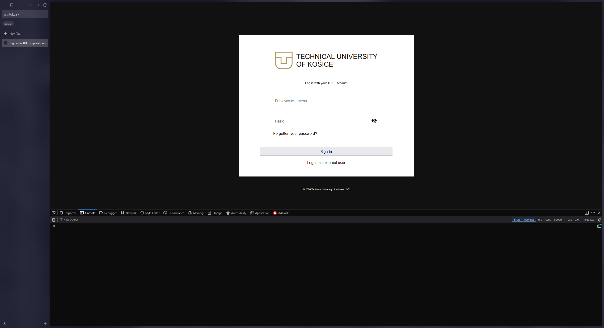
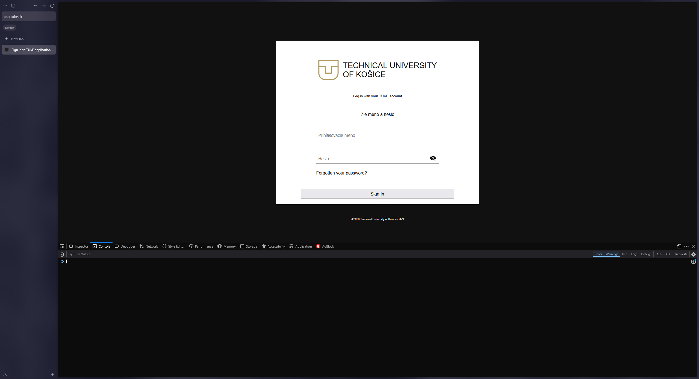

# [BUG-003] Inconsistent Localization and Missing Language Switcher on SSO Login

**Severity:** Medium
**Priority:** Medium 

---
## Summary
The SSO login page (sso.tuke.sk) displays a "Mixed Language" interface (English and Slovak combined) and lacks a language switcher. This occurs because the application fails to load the English localization file (en.json), as seen in the console.

## Environment
- **URL:** https://sso.tuke.sk/ (SSO Login Page)
- **Browser:** Zen Browser 1.18.10b (64-bit) / Based on Firefox 147.0.4
- **OS:** Windows 11
- **Testing Type:** Grey Box / Localization & UX Testing

## Steps to Reproduce
1. Navigate to `https://www.tuke.sk/sk` and switch the language to EN.
2. Click on the Chatbot icon (bottom right) to redirect to the SSO page.
3. Open DevTools (F12) and check the Console tab for errors.
4. Leave all input fields empty and click the "Sign in" button.

## Actual Result
- **Mixed Language Interface:** The page displays inconsistent localization; while the header is in English ("Log in with your TUKE account"), the input placeholders ("Prihlasovacie meno", "Heslo") and error messages are in Slovak.
- **Non-localized Error Message:** Upon submitting an empty form, the system displays the error "Zlé meno a heslo" in Slovak, with no English translation provided.
- **Missing Language Selection:** There is no UI element (button, icon, or dropdown) on the SSO page that allows a user to manually switch the interface language.

## Expected Result
- **Consistent English UI:** All text elements, including placeholders and system messages, should be displayed in English if the user arrived from the English version of the main site.
- **Localized Errors:** Error messages should be translated into the active session language.
- **Manual Override:** A language switcher ("SK / EN") should be present on the login form to allow users to fix localization issues manually.

---
## Evidence

### 1. Initial State (Mixed Language)
The form appears with an English header but Slovak placeholders ("Prihlasovacie meno", "Heslo").

### 2. Validation Error (Slovak only)
After clicking "Sign in" with empty fields, the system returns a Slovak error message "Zlé meno a heslo".
